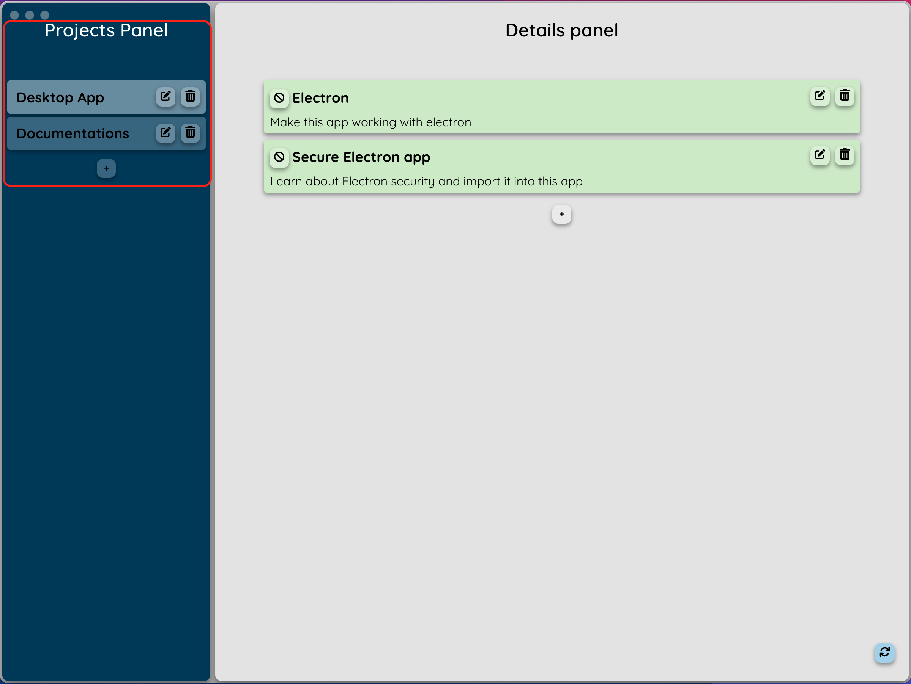

# Current state :
- Fully working React app
  - Just clone this repo, and, inside the projet folder, run npm start.
- Electron integration to use the app as a desktop app
  - Just clone this repo, and, inside the projet electron fodler of this projet: 
    run the command npm install --save-dev electron, and,
    run npm start (from electron folder)

# Goals / Knowledge
| Goal | Knowledge | Done |
|---|---|---|
|Learn JavasScript|Understand JavaScript syntax and function Understand Node JS usage Practice coding in JavaScript with Node JS|Done|
|Learn React|Understand how React work|Done|
|Learn Redux|Understand what is Redux Understand how redux work Understand what is Reducer, Dispatcher...|Done|
|Code a web application with React|Know how to code a React application|Done|
|Use Redux in a React application|Know how to setup Redux Know how to use Redux store, Reducer, Dispatcher...|Done|
|Use a REST API|Know how to make http request to interact with a REST API Use Axios to make requests|Done|
|Use Json-server as a fake REST API|Interacting with json-server through a fake REST API using Axios|Done|
|Wrap a web application with Electron|Learn and understand how work Electron Setup Electron and make a basic desktop app|Not Done (Build issue)|
|Secure an Electron app|Learn why Electron isn't secured Learn how to secure an Electron app (no node integration, context isolation, sandbox, https only...)|Done|

# React todolist App

This app was made for a project during my studies.

In the current state, this app can't be used as a project managing app. Many others apps are a way better for that.
However, this app can be used by peoples who want to learn JavaScript, React and Redux, and wrap their app with Electron.

The code is pretty basic and easily understandable

## What is this app ?

When the app is stated, it's look like :

As we can see, we have two panels, the projects panel to manage our projects, and a details panel to manage tasks in a project.

### Projects panel
In this exemple, I have two projects :

We can create a new project with the **+** button :

We can change a project name with the **edit** button :

And we can delete a project with the **delete** button :

### Details panel :
I will take my "Desktop app" project for exemple.

We can see all my tasks in this project:

We can create a new task with the **+** button :

We can edit a task with the **edit** button :

We can delete a task with the **delete** button :

Aslo, we can set a task to be *Done* with the **validate* button :

By the way, the *Done* state of a task can be canceld by clicking on the **validate** button when a task is *Done*.

## How to use Electron

Firsly, we need to create a new project, just a folder. Inside we run the command *npm init* to initialize a Node JS project.

After, we can install Electron as a Node JS modules by running the command *npm install --save-dev electron*.

We have to configue the Electron app. In my case, my config is :

We can now create the main file of the Electron app. In my case and as we can see in my configuration file, the name of this main file must be *index.js*

Now we can write the basic code to make a working Electron app :

With these few lines of codes, i just create a new window (the app), with some properties to define how the window will look, all oh that when the app is ready.

I had some actions on events to make the window closable and collapsible, also in MacOS which isn't like on Windows or Linux.

I also add a preload function :

This file contain functions that are executed before the application is loaded. In my case, i just put electron current version.
Also, I execute two shell commands to load my React application and the json-server (*run* & *server* node script).
